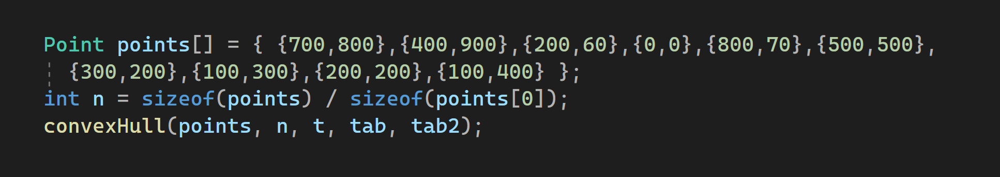
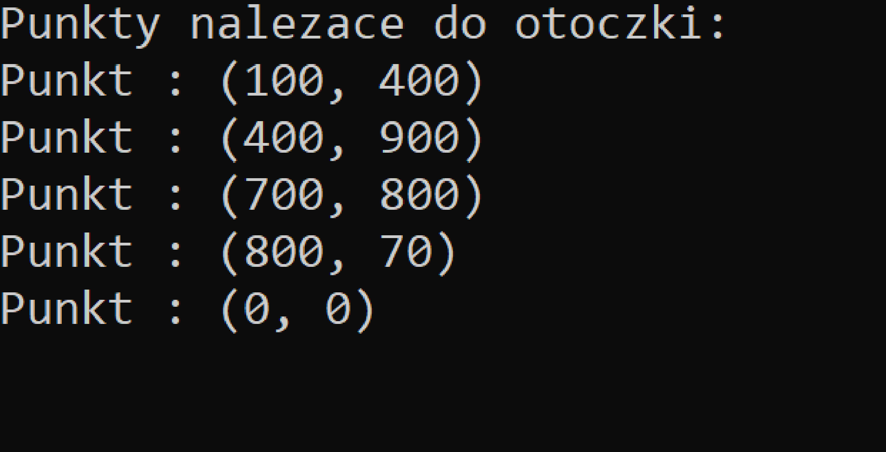
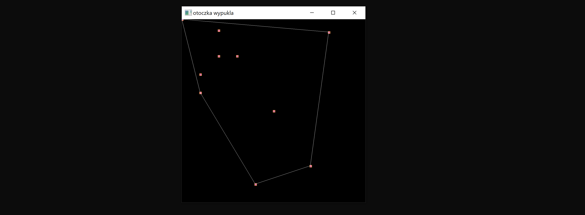

# convex_hull

Do obliczenia punktów należących do otoczki wykorzystany został algorytm Grahama. GUI stworzone 
zostało z pomocą biblioteki SFML.

Przykładowy zestaw danych wejściowych:

Wyniki kompilacji programu:

Konsola:

Okno GUI:

